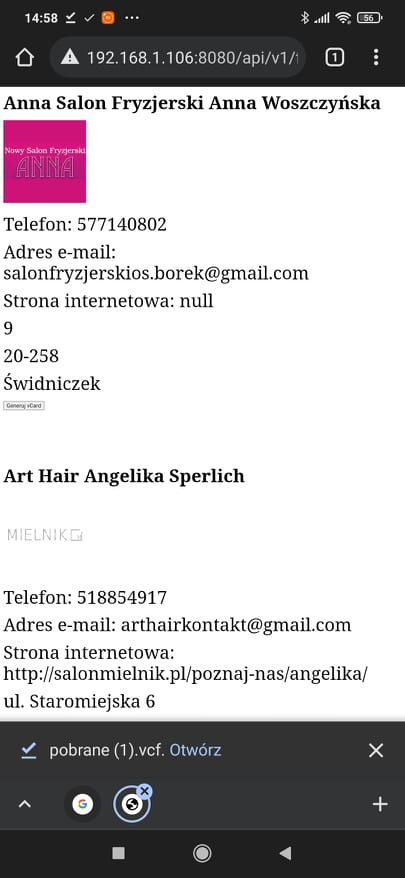
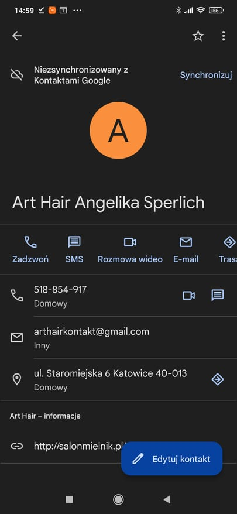

# VCard
API umozliwiające pobieranie i wyswietlanie wizytówek firm z serwisu https://panoramafirm.pl/
na  podstwie wyszukiwanej frazy. Apikacja uruchamia sie na porcie 8080


## Składnia
```
host/api/v1/{szukana_fraza}
```
## Przykład
```
http://localhost:8080/api/v1/fryzjer
```
## Wynik



